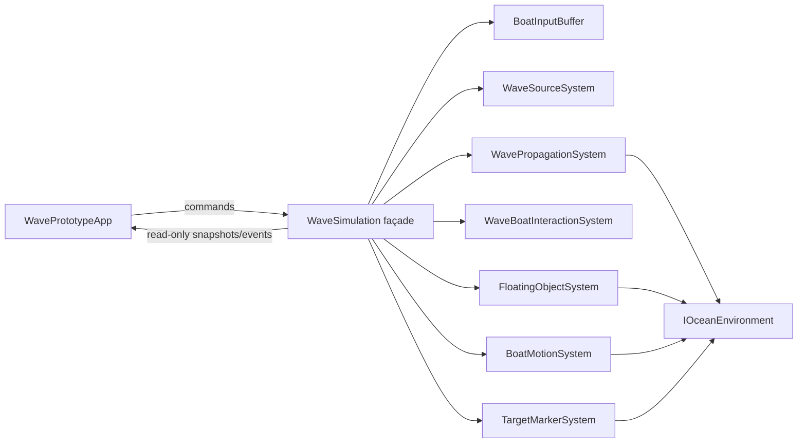
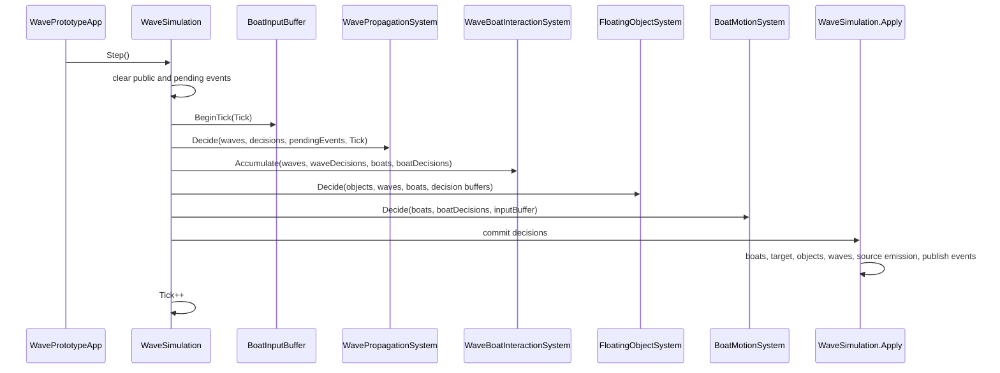

# Architecture and Lifecycle

## Assembly boundary

| Assembly | Platform | References | Responsibility |
|---|---|---|---|
| `WavePrototype.Simulation` | All | UnityEngine only | State, deterministic systems, environment, algorithms |
| `WavePrototype.Presentation` | All | Simulation | Unity lifecycle, input, cameras, meshes, HUD, interpolation |
| `WavePrototype.Editor` | Editor only | Simulation, Presentation | Validation, benchmarks, scene generation, builds |

Assembly-definition references enforce the dependency direction. The simulation does not
reference presentation or editor code. It does use `UnityEngine.Vector2` and `Mathf`, so it
is independent of Unity lifecycle and physics but does not compile without Unity libraries.

## Ownership

`WaveSimulation` is the only owner of the authoritative entity collections:

- waves;
- boats;
- floating objects;
- current public events;
- pending events;
- tick-addressed input state;
- source/system state through `WaveSourceSystem`; and
- target and collection state through their internal services.

Consumers receive `IReadOnlyList<T>` views or value copies. Mutation is requested through
methods such as `AddBoat`, `QueueBoatControl`, `SpawnSwellFront`, `SpawnFloatingObject`, and
target operations.

## Authoritative, decision, and presentation state

There are three state layers:

1. **Authoritative state** is persistent and appears in `WaveData`, `WaveSegmentData`,
   `BoatData`, `FloatingObjectData`, source/system state, target state, input state, and
   coordinator counters.
2. **Decision state** exists during one simulation tick in `WaveDecision`,
   `WaveSegmentDecision`, `BoatDecision`, and `FloatingObjectDecision`. Systems write these
   buffers without committing persistent changes.
3. **Presentation state** contains render snapshots, interpolation dictionaries, camera
   smoothing, mesh buffers, UI state, and diagnostic caches. It never feeds interpolated
   positions back into authoritative state.

## Fixed-tick sequence

`WavePrototypeApp.Update` accumulates unscaled render time. While at least one fixed step is
available, it calls `StepOnce`, with a guard of six simulation steps per rendered frame.
The accumulator accepts at most 0.1 seconds from any one frame. This prevents an unlimited
catch-up loop after a stall, at the cost of slowing simulated time relative to real time
under sustained overload.

`WaveSimulation.Step` executes this exact order:

Important consequences:

- Wave/boat interaction uses the wave decisions for the current tick and authoritative boat
  state from the start of the tick.
- Floating objects can add force and yaw to the same boat decision buffer before boat motion.
- Boat motion consumes all accumulated forces plus the held control.
- Target arrival is tested after boat movement is committed.
- Waves are removed or updated after boats and objects have used their decisions.
- Scheduled source emission happens during Apply after expired waves are removed.
- Events produced during Decide and Apply become public together at the end of Apply.
- `Tick` is incremented after source maintenance, so source code receives the pre-increment
  tick value.

## Reset lifecycle

`WaveSimulation.Reset(seed)`:

1. Resets counters, IDs, ticks, lists, decisions, events, and the input buffer.
2. Creates a new environment from the configured half-extents and seed.
3. Recreates all internal systems against that environment.
4. Resets the wave-source random stream and definitions.
5. Adds the three prototype boats and records the player ID.
6. Creates and safely places the target.
7. Creates and seeds the floating-object service.
8. Reconstructs the already-running initial swell.

Resetting with the same configuration and seed reproduces the same starting state.

## Input and replay

Controls are `BoatControlCommand` values addressed to a simulation tick and boat ID.
`BoatInputBuffer.Queue` rejects invalid boat IDs at the coordinator and rejects commands
whose tick is older than the current tick. Pending commands are sorted by tick then boat ID.
A duplicate tick/boat command replaces the previous pending value.

At `BeginTick`, every command whose tick is less than or equal to the current tick becomes
that boat's held control and is copied to the applied history. A boat keeps its last control
until another command replaces it. Replay constructs an identical simulation, queues the
recorded command stream, advances the same number of ticks, and compares state hashes.

Manual debug operations—spawning waves, boats, cargo, wreckage, or relocating the target—are
deterministic when repeated in the same order but are not encoded in the recorded boat-control
stream.

## Events

Systems append `SimulationEvent` values to `pendingEvents`. `Apply` may append damage,
collision, target, expiry, or object lifecycle events. At the end of Apply, pending events
are copied to the public `Events` list. The list represents only the most recently completed
tick and is cleared at the start of the next tick.

Events are observations, not commands. No event handler mutates the simulation during the
tick that produced it.

## Deterministic state hash

`CalculateStateHash` implements an FNV-1a-style 64-bit fold. Floats are mixed by their exact
IEEE-754 bit representation. It includes:

- seed, tick, IDs, random states, and configuration;
- target and salvage totals;
- every source and swell-system field;
- every wave and segment field;
- every boat, active held control, and floating object;
- unconsumed pending control commands; and
- the current public event list.

It deliberately does not include presentation data, mesh contents, camera state, UI toggles,
decision buffers after a completed tick, or the already-applied command history. The supported
claim is same-build, same-platform repeatability. Cross-platform bitwise equality is not
claimed.

## Architectural invariants

- Systems own behavior; data structures carry state.
- Simulation state changes only through the coordinator's Apply phase, except explicit
  external setup/debug methods called between ticks.
- A boat never stores a wave reference and a wave never stores a boat reference.
- A broad crest contributes at most one selected segment to one boat/object encounter.
- Energy is authoritative; amplitude, steepness, and interaction force are derived.
- Environment queries return information and do not mutate entities.
- Rendering observes simulation snapshots and never changes physics.
- Source phase time, not current population, controls natural emission.
- Source ID and swell-system ID zero mean manual/local debug waves.
- Stable IDs are monotonic within one reset and restart from one after reset.
