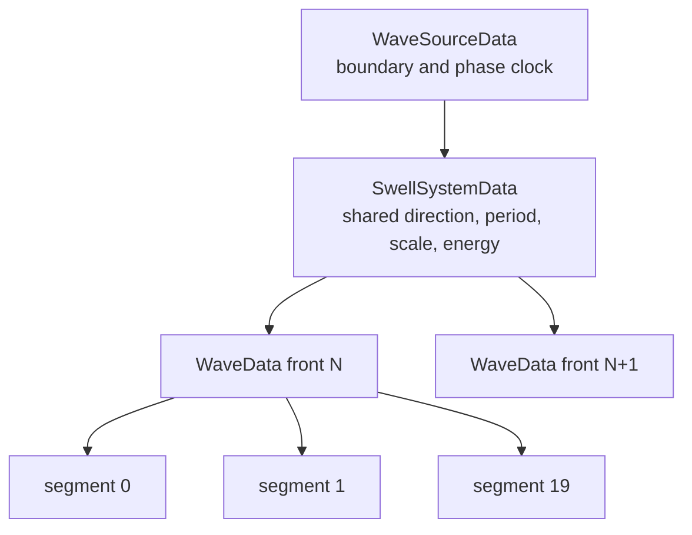

# Wave and Ocean Model

## Representation

The simulation models energy packets, not water particles and not a continuous surface.
One `WaveData` is one crest identity. Its ordered `WaveSegmentData[]` supplies local
authority along the crest so different portions can refract, break, stop at land, hit
rocks, or disappear independently.



The parent is not a second physical wave. Its position, direction, energy, speed, and state
are aggregate diagnostics and compatibility data derived from active sections. Physics
acts on sections but enforces one selected section per crest/entity encounter.

## Energy-derived quantities

Given coherent energy `E`, sampled depth `D`, and packet length `L`:

```text
depthInfluenceLimit = max(6.5, L × 1.75)
effectiveDepth      = clamp(D, 0.35, depthInfluenceLimit)
amplitude           = sqrt(max(0, E)) × (1 + 0.45 / effectiveDepth)
steepness           = amplitude / max(0.25, L)
interactionForce    = E × (1 + 0.7 / effectiveDepth)
```

This deliberately makes shallow water increase derived amplitude, steepness, and force
without storing amplitude as independent state. Depth beyond the influence limit is
mechanically irrelevant to the packet.

## Deep-water speed and phase spacing

The system's deep-water cruise speed is:

```text
deepSpeed = min(BaseWaveSpeed, 3.2 + sqrt(max(0.1, L)) × 2.45)
```

When a swell system is created, its packet spacing is:

```text
packetSpacing = deepSpeed(meanPacketLength) × periodSeconds
```

The default western period is selected deterministically from 2.3–2.7 seconds. Seed 1847
produces approximately 2.53 seconds, or 76 fixed ticks. Initial front centers begin at half
a phase and continue in periodic slots along the source direction. The first runtime front
is scheduled for the remaining half-period. Later schedules advance by exactly one period
from the previous scheduled tick, even if an emission attempt fails.

`TargetWaveCount` constructs the initial already-running sea. It does not cause replacement
when terrain, decay, or retirement lowers population.

## Source and system creation

`WaveSourceSystem.Reset` defines:

| Source | Boundary | Base direction | Spread | Weight | Period | Enabled |
|---|---|---:|---:|---:|---:|---|
| Western | Full western edge, inset 2 | East | 0.6° | 1 | 2.3–2.7 s | Yes |
| Northern cross-sea | North edge from -35% width to east | -58° | 3.8° | 0 | 4.2–6.2 s | No |
| Southern cross-sea | South edge from -20% width to east | 42° | 3.8° | 0 | 4.5–6.5 s | No |

An enabled source lazily creates one persistent `SwellSystemData`. The stream chooses:

- mean packet length from 4.35–5.9;
- direction from ±28% of source spread;
- mean crest length equal to projected cross-map span plus at least 8 units of overdraw;
- period from the source period range;
- base energy from 0.82–2.1 for western swell, or 0.68–1.85 for cross-seas.

Each emitted natural front varies packet length and crest length by ±3%. Direction and
energy receive small deterministic sinusoidal phase variation. Runtime front position is
the source-segment midpoint plus 0.45 units along travel direction.

The initial-world path first places unique phase slots. Very high-count benchmark worlds
can exhaust those slots; only then does `TrySeedHighDensityFallback` place additional
system-attributed fronts along the deep basin. That fallback is benchmark scaffolding, not
normal ocean composition.

## Crest segmentation

For a crest at least 16 units long:

```text
segmentCount = clamp(round(crestLength / targetSpacing) + 1,
                     5,
                     WaveMaximumSegments)
```

Short manual crests receive one section. Defaults use target spacing 13.5 and a maximum of
20, so a normal 266–270-unit map-spanning crest reaches the 20-section cap. Sections are
placed from `-crestLength/2` to `+crestLength/2` along the axis perpendicular to travel.
Every section starts with the same direction, speed, and energy, but samples its own depth
and gradient.

## Per-tick section propagation

For each active section, `WavePropagationSystem` performs:

1. Determine effective depth and the target local speed.
2. Move speed toward that target according to traveling/breaking/spent rules.
3. Refract traveling direction laterally toward shallower water when shallow enough.
4. Apply ordinary coherent-energy and foam decay.
5. Propose the next position.
6. Refresh environment samples on the section's deterministic staggered phase.
7. Derive amplitude, steepness, depth ratio, and interaction force.
8. Determine requested breaking severity from steepness, depth, land, and rocks.
9. Smooth breaking intensity toward the requested severity.
10. Dissipate coherent energy into foam when breaking intensity is active.
11. Apply additional rock absorption or terminal land behavior.
12. Determine state and activity.

### Staggered environment sampling

Depth and gradient refresh every `WaveEnvironmentSampleInterval` ticks. Default interval is
four. The phase is derived from `(wave.Id × 17 + segment.Index × 7)`, distributing samples
deterministically across ticks. Movement and energy still update every tick. Deep samples
store a zero gradient.

### Local speed

If sampled depth is beyond the packet's influence limit, target speed is deep-water speed.
Otherwise:

```text
targetSpeed = min(deepSpeed, sqrt(9.81 × max(0.1, effectiveDepth)))
```

A traveling section approaches a lower target using `WaveShoalingDeceleration` and a higher
target using `WaveDeepRecovery`. Therefore a surviving section can speed up again after it
returns to deep water. A breaking section can slow but does not accelerate until it resumes
traveling. A spent section approaches zero speed at 4.2 units/s².

### Refraction

For traveling sections only:

```text
weight = clamp01((6.5 - effectiveDepth) / 5.5)
towardShallow = -normalize(depthGradient)
lateralBend = towardShallow - direction × dot(towardShallow, direction)
direction = normalize(direction + lateralBend × refractionStrength × weight × dt)
```

Only the lateral component is used, avoiding a direct reversal toward shallow water.

## Breaking and foam lifecycle

Two independent criteria request breaking:

```text
steepness >= BreakingSteepness
amplitude / effectiveDepth >= DepthLimitedBreakingRatio
```

`BreakingSeverity` maps the threshold to 0.22 and 1.8 times the threshold to 1.0. Land
requests 1.0; rock contact requests at least 0.85. Intensity attacks at 4.2/s and recovers at
0.9/s by default. A nonzero request immediately establishes a floor up to 0.22, making a
new breaker mechanically visible without waiting several ticks.

When intensity is at least `BreakingReleaseIntensity`:

```text
lossRate = lerp(BreakingMinimumEnergyLossPerSecond,
                BreakingEnergyLossPerSecond,
                breakingIntensity)
energyAfter = energyBefore × exp(-lossRate × dt)
foam += (energyBefore - energyAfter) × BreakingEnergyToFoam
```

Foam separately decays exponentially. It never creates another wave or applies independent
force. If shallow breaking sheds enough energy that both breaking criteria fall away,
intensity recovers below the release threshold and the remaining coherent wave returns to
`Traveling`, even while foam remains visible.

A section begins a `WaveStartedBreaking` event when its previous state was traveling and its
current requested severity is nonzero. Re-entry after recovery can produce another event.

## Rocks, land, expiry, and shadows

Rock queries are skipped for sampled depth at or above 5 because generated rocks exist only
on shelves. A contact immediately retains:

```text
1 - RockEnergyAbsorption × 0.32
```

of coherent energy, transfers the loss to foam, and produces `WaveHitRock`. The default
retention is 86.56% before ordinary/breaking decay.

Land is terminal for a section: it does not advance, speed becomes zero, energy receives
spent-state decay, and foam cannot keep that land section active by itself. Outside-world
sections also deactivate. A non-land section may remain active below minimum coherent energy
while it has at least minimum foam energy.

When an island removes central sections while outer sections continue, the missing chain
creates the observed wave shadow. There is no diffraction or later reconstruction behind
the island.

## Crest coherence

After every section decides independently, active traveling neighbors may link when their
separation is no greater than:

```text
nominalSpacing × WaveSegmentLinkBreakMultiplier
```

Linked neighbors influence direction. An interior section with both neighbors also receives
a forward-axis position correction toward their midpoint. Lateral correction is intentionally
omitted. Breaking, spent, inactive, or sufficiently separated neighbors do not link, allowing
the crest to split around obstacles.

The coherence pass writes proposed directions only after calculating neighbor influence, so
one section's new coherent direction does not cascade immediately through the remainder of
the same pass.

## Parent aggregation and retirement

Active-section position, direction, energy, speed, and interaction force are averaged. The
wave retires when:

```text
activeSegments < ceil(originalSegments × WaveMinimumActiveSegmentFraction)
```

Single-section waves require their one section. Default broad fronts require at least 45% of
their original sections. Retirement removes the complete parent during Apply and emits
`WaveExpired`; surviving scraps do not become independent wave identities.

## Manual formats

- `SpawnSwellFront` creates one current natural-format front attached to the active stream.
- `SpawnWave` creates one short source-zero manual packet with energy-scaled dimensions.
- The presentation's `Shift+Q` calls `SpawnWave` seven times across the local crest axis and
  is explicitly a legacy breaker-comparison tool.
