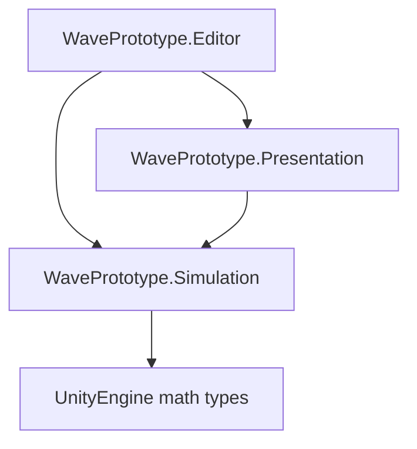

# Tactical Sailing Developer Manual

## Snapshot

This manual describes the Batch 13 project at Git commit `337f521`, tagged
`batch-13-baseline`. It is a frozen technical description, not a promise that later
batches retain the same implementation.

- Project: Tactical Sailing / Wave System Prototype
- Unity: `6000.3.2f1` (`a9779f353c9b`)
- Normal world: 450 x 250 simulation units
- Simulation rate: 30 authoritative ticks per second
- Normal ocean: one western source, one swell system, 20 initial fronts
- Primary scene: `Assets/WavePrototype/WaveDemo.unity`
- Windows player: `Builds/Batch13/TacticalSailingBatch13.exe`

The intended reader is a C# and Unity developer who has not previously seen the project.
The manual is designed to explain the project before the reader opens the source. Function
signatures and algorithms are described, but source code remains authoritative when making
changes.

## Reading order

1. [Project and Setup](01_PROJECT_AND_SETUP.md)
2. [Architecture and Lifecycle](02_ARCHITECTURE_AND_LIFECYCLE.md)
3. [Data Model](03_DATA_MODEL.md)
4. [Public API and Internal Services](04_PUBLIC_API_AND_SERVICES.md)
5. [Wave and Ocean Model](05_WAVE_AND_OCEAN_MODEL.md)
6. [Boats, Environment, Targets, and Floating Objects](06_BOATS_ENVIRONMENT_AND_OBJECTS.md)
7. [Presentation and Controls](07_PRESENTATION_AND_CONTROLS.md)
8. [Configuration and Tuning Reference](08_CONFIGURATION_REFERENCE.md)
9. [Validation, Building, and Performance](09_VALIDATION_BUILD_AND_PERFORMANCE.md)
10. [Extension Guide](10_EXTENSION_GUIDE.md)
11. [Complete Symbol Catalog](11_COMPLETE_SYMBOL_CATALOG.md)
12. [Limitations and Glossary](12_LIMITATIONS_AND_GLOSSARY.md)

The top-level `Reference Document.txt` and `PROJECT_DIRECTION_ADDENDUM_v1.1.md` contain
product and architectural intent. `BATCH5_ARCHITECTURE.md` through
`BATCH13_LONG_PERIOD_SWELL.md` preserve the historical reasons for major changes. This
manual describes the resulting Batch 13 state rather than retelling that history.

## Fast orientation

The project has three assemblies:

`WaveSimulation` is the supported façade and sole owner of authoritative entity lists.
Internal systems calculate temporary decisions. `WaveSimulation.Apply` commits those
decisions. `WavePrototypeApp` reads the resulting snapshots, renders meshes, accepts user
input, and never writes interpolated values back into simulation state.

The fastest source reading order is:

1. `SimulationTypes.cs`
2. `WaveSimulation.cs`
3. `WaveSourceSystem.cs`
4. `WavePropagationSystem.cs`
5. `WaveBoatInteractionSystem.cs`
6. `FloatingObjectSystem.cs`
7. `BoatMotionSystem.cs`
8. `OceanEnvironment.cs`
9. `WavePrototypeApp.cs`
10. `BatchBuild.cs`
